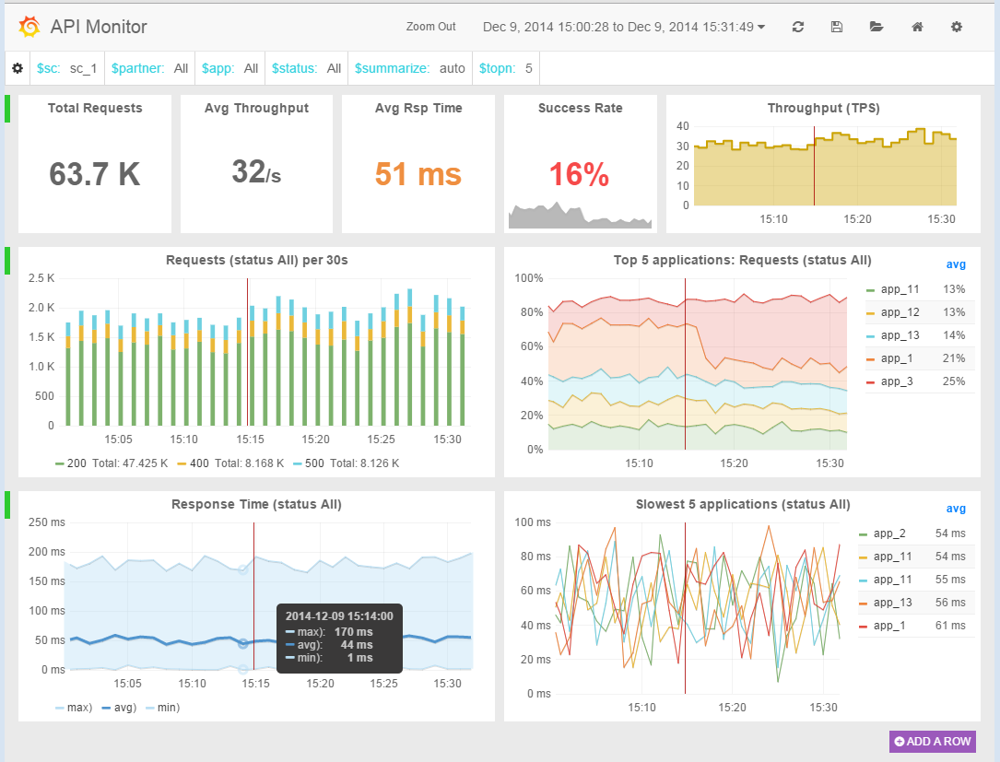

This demo uses Graphite and Grafana to store and present API metrics. The demo environment is installed on Ubuntu.

## Graphite

Graphite has two major components. 

The first is `carbon-cache`, which is a daemon process to receive metrics data from client through TCP connection and store into filesystem via `whisper` database library.

Another one is a webapp. It provides HTTP API for generating graphs and retrieving raw data.

Since Ubuntu 14.04, it's easy to install graphite with `apt-get`:

``` sh
sudo apt-get update
sudo apt-get install graphite-web graphite-carbon
```

Both `carbon` and `graphite-web` are installed as python module. 

Start carbon:

``` sh
sudo service carbon-cache start
```

Graphite-web is base on django framework. Read `/usr/share/doc/graphite-web/README` for how to setup graphite-web. A major steps is to create database and default data:

``` sh
sudo graphite-manage syncdb
sudo chown _graphite:_graphite /var/lib/graphite/graphite.db
```

For testing Graphite, you can start Graphite with the Django lightweight Web server for development:

``` sh
sudo -u _graphite /usr/bin/django-admin runserver --settings graphite.settings 0.0.0.0:8080
```

To install on Apache, follow the guide in `/usr/share/doc/graphite-web/README`. 

``` sh
sudo apt-get install libapache2-mod-wsgi
sudo cp /usr/share/graphite-web/apache2-graphite.conf /etc/apache2/sites-available/graphite-web.conf
sudo a2ensite graphite-web
sudo service apache2 restart
```

Graphite-web 0.9.12 only works under URL root path, it conflict with Apache default site setting. I modify `/etc/apache2/sites-enabled/graphite-web.conf` to make it work in a virtual host on port 81.

``` apache
Listen 81
<VirtualHost *:81>
 ...
</VirtualHost>
```

Reference:

- https://www.digitalocean.com/community/tutorials/how-to-install-and-use-graphite-on-an-ubuntu-14-04-server

## Grafana

Download grafana package and extract to a directory. Configure Apache web server to make the grafana directory accessable.

Edit `config.js` (copy from `config.sample.js`) to enable graphite as datasource.

Because graphite-web is hosting on virtual host on port 81, which is different than where grafana is hosting, there is cross site script access restriction. Have to enable CORS (cross origin resource sharing) on graphite-web side.

Enable Apache mod_headers:

~~~ sh
sudo a2enmod headers
~~~

Add into `/etc/apache2/sites-enabled/graphite-web.conf`:

~~~ apache
Header set Access-Control-Allow-Origin "*"
Header set Access-Control-Allow-Methods "GET, OPTIONS"
Header set Access-Control-Allow-Headers "origin, authorization, accept"
~~~

## Elasticsearch

Elasticsearch is used by Granfan as a database to persistent dashboard configuration. Search and analystics features of Elasticsearch isn't used in this case. Without Elasticsearch Grafana still works, but unable to save any change to dashboard design. You have to export dashboard JSON and import next time you want to use it.

``` sh
wget https://download.elasticsearch.org/elasticsearch/elasticsearch/elasticsearch-1.4.1.deb
sudo dpkg -i elasticsearch-1.4.1.deb
```

Elasticsearch is not starting on bootup by default. To setup as service, run:

``` sh
sudo update-rc.d elasticsearch defaults 95 10
```

To start manually, run:

``` sh
sudo /etc/init.d/elasticsearch start
```

To enable CORS (cross origin resource sharing), add below into `/etc/elasticsearch/elasticsearch.yml`:

``` yml
http.cors.enabled: true
```

## Demo

The scala script `feed_graphite.scala` generates mock API metrics data for demo. The Grafana portal is defined as `api.json`. Both files are stored in this [gist](https://gist.github.com/aleung/1ec7e56bfa9448af920b).




