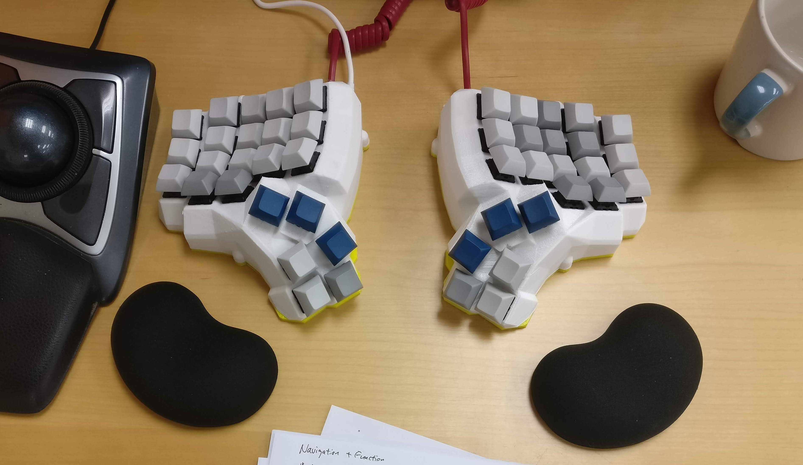

去年底今年初先后做了两个分体的人体工学键盘。

<!-- more -->

用着微软的人体工学键盘4000好多年了（以前写过[一篇介绍](/blog/2013/01/08/keyboard-and-mouse/)，里面也有照片），对它唯一不满的地方是太大了，占用了桌面不少空间。实际上我根本用不着小键盘，如果不要右边那一块，桌面就宽敞不少。

对市面有售的键盘又做了一番了解，找不到合适的。本来左右手分区的键盘就很罕见，符合我的期望，并且买得到和买得起根本没有。不过倒是发现有不少爱好者自己设计制作键盘并且开源的，有3D打印机打印壳体，做起来似乎不会太难。Reddit的 [r/MechanicalKeyboards](https://www.reddit.com/r/MechanicalKeyboards/) 是爱好者的其中一个大本营，上面各种各样的键盘让人眼花缭乱。其中，一款叫做 [Dactyl](https://github.com/adereth/dactyl-keyboard) 的键盘，和由它派生出来的 [Dactyl-Manuform](https://github.com/tshort/dactyl-keyboard) 键盘，有不少人制作过，资料相对齐全些，外形也比较符合我的要求：左右手按键分离、带倾斜度适应手掌自然摆放的角度、占地不多。

做键盘首先要做的功课的选择什么键轴（按键键体）和什么键帽。大部分的机械键盘爱好者玩的也就是把这些东西换来换去。我对机械键盘没有什么情结，除了在年代久远的时候用过的 IBM PC 是机械键盘，实在理解不了噼里啪啦的敲键快感在哪里。不过要自己做，能买到的键必然是机械按键了。各种各样的键轴在发烧友口中说得神乎其神，我就挑选了据说是最平庸的 Cherry 茶轴。另外，键帽也有不同高度、倾斜度和材质的讲究。我要做的键盘的键盘体自身已经带有弧度，就不需要键帽再有高度、弧度的区别，所以选择了DSA规格的无刻（上面没有印字）键帽。

受了网上一些文章的影响，第一个键盘选择了比较激进的最少键位的方案：主键盘区为3行10列，连数字键都没有，很多按键需要靠同时按拇指区的切换键来打出来。这样做的好处是手在键盘的位置是固定的，手腕就搁在手托上按什么键都不需要挪动。但是代价就是脑子不够用了：拇指需要按的切换键太多，记不住。

用了几个星期，还是难以做到肌肉记忆不去想怎么去按键，于是打算再做了一个多些按键的。之前选择最少键位方案的另外一个原因是我的3D打印机可打印面积不够大，加一行或者加一列都会超出打印床的大小了，因此首先得解决怎么能够适应打印面积的问题。

第一个想法是将拇指区与主键盘区分离成两个部分独立打印。这就需要修改壳体的3D模型。Dactyl 这个项目比较有意思，模型是用Clojure程序生成的，因此我也就顺便（被迫）学习了 Clojure，感受还不错，终于有机会接触 lisp 风格的函数式编程了。做出来的版本是这个：[dactyl_split.clj](https://github.com/aleung/mini-thumb-dactyl-keyboard#dactyl-manuform-thumb-part-printed-separately-wip)，打印过一个样品出来，但我没有最终完善它的所有细节，因为有了一个新的想法。

Manuform的拇指区每边有6个键。一个大拇指要按6个键太困难了，有些键的位置比较难够得着，记忆的负荷也太大，总是要想一想按哪个。按照自己用下来的情况，一个拇指可以比较容易的靠肌肉记忆按2个键，最多也就是控制3个键。把拇指区改小了，打印面积也就缩小了。

于是就做出了我的派生作品：[Mini Thumb Dactyl](https://github.com/aleung/mini-thumb-dactyl-keyboard#mini-thumb-dactyl) —— 缩小了拇指区的 Dactyl-Manuform。也就是标题照片里面的键盘。这个即使增加了一行和一列，都能够在我的3D打印机上打出来。

制作一个键盘主要包括三部分的工作：壳体、电路、固件（firmware）。壳体用3D打印机打印，如果别人做好的现成的STL模型不满足要求，就要自己去修改。电路的核心是 [Arduino](https://www.wikiwand.com/zh-hk/Arduino) 兼容的电路板，因为左右手键盘是独立的，两边各一片。Firmware基于开源的键盘固件 [QMK](https://qmk.fm/)，不需要自己编码，但是它的配置与按键电路连接相关（不同的按键数量会不同），按键映射也需要自己去配置。

开源作品是不同开发者在前人基础上不断改进的过程，但也带来了很多版本分支。网上的资料比较零碎，没有从头到尾的系统有条理的文档，而且不同资料有些描述各不一样，分别适应于某个特定的分支。寻找资料、整理信息、理清关系是比较麻烦的事情。因此我把制作的具体过程中的所有关键信息整理写成了一份 [How to Make a Dactyl Manuform Keyboard](https://github.com/aleung/mini-thumb-dactyl-keyboard/blob/master/guide/index.md) ，以此为主线，相关的知识点可以再去阅读、搜索。