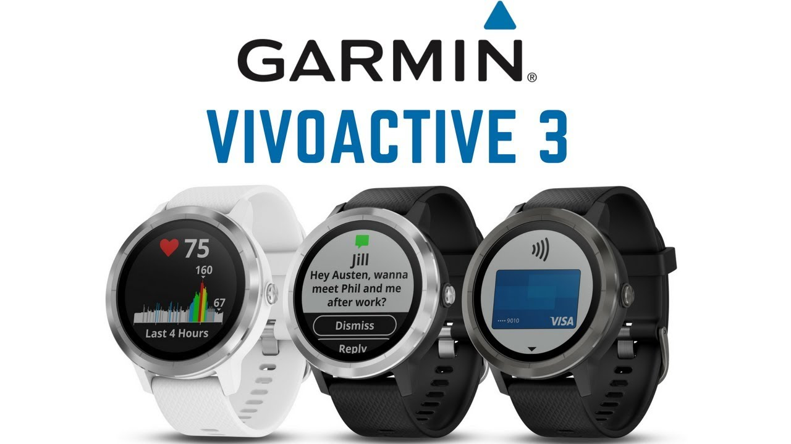

最近将  手表换掉了，新的手表是 Garmin 的运动手表 [Vivoactive 3](https://www.garmin.com.cn/products/sports-recreation/vivoactive3pvd/) (VA3)。

<!--more-->

## 功能考虑

Vivoactive系列的定位是休闲运动，支持的运动模式特别多，但是没有特别专业的功能，以跟其他主打专业的手表型号形成区分。从传感器来看挺齐全的，除了GPS、加速度、电子罗盘、心率这些基本的，还有温度、气压传感器。其实硬件多一点成本差不了多少，功能之间的区别更多是软件上的。

这款手表有几个型号：

- 标准版本名称没有任何后缀
- Music版增加了音乐播放器功能，可以连接蓝牙耳机
- Trainer版是简化版本，少了支付功能，少了侧滑控制

我的运动主要是跑步、徒步，偶然游泳和自行车，需要的运动记录功能和信息这款手表都能够提供了。VA3没有户外徒步的运动模式，但是安装 ConnectIQ 的 app 和 data field 可以满足要求。

原来的 Pebble / Pebble Time 作为日常佩戴，除了时间外最主要的使用的几个功能包括：手机来电和消息推送的显示，手机音乐播放器的控制，睡眠记录。确认过 Garmin 的手表都能支持这些功能，一个手表就能同时满足日常佩戴和运动的需要了，不需要运动时再换表，方便一些。

Garmin Pay 关联银联卡后，可以用手表闪付。我一向跑步不带手机，现在多个支付手段也好，可是支持闪付的店铺太少，还是用处不大。

VA3只有一个物理按键，大部分操作都要靠触摸屏，专业表就不会这样设计，在运动过程中的操作还是物理按键更高效。它还有个侧滑控制，但用起来很不顺手，也不是太灵敏，后来我就把它关掉了。

看起来，trainer少了的两大功能也都不是很重要。

## 耗电测试

日常活动跟踪（心率、计步等）功能都打开的前提下做了一系列耗电量测试：

- 不停的操作手表，没有开GPS：7.5%/h 
- 平常佩戴 / 睡眠，无操作：0.5%/h 
- 打开GPS运动模式，不使用Connect IQ data field，频繁查看手表：<10%/h 
- 使用HoneyHike data field：15.9%/h，暂停时～13%/h 
- 运动时使用了 Connect IQ 的field会比内置的耗电，耗电量与field是否处于显示状态无关，即使 field 不在当前显示页面中，也一样耗电。 

不运动的话，日常佩戴大概一个星期看起来是没有问题的。运动模式下GPS打开时耗电量就有点大了，例如跑步可能勉强9个小时左右，我不跑长距离越野跑，应付一个马拉松是绰绰有余了。

现在感觉最不足的地方是徒步时的电量续航：目前找到最适合徒步应用的 ConnectIQ data field 是 HoneyHike，但它的耗电比较大，续航时间不足6小时。轻量级的徒步往往也会超过6小时，必须要中途休息时充电才行。估计这也是这款手表不提供 hiking 模式的原因。

## ConnectIQ

应该说支持 ConnectIQ 的手表才能勉强算得上智能手表。Garmin提供了SDK给第三方开发手表应用。但是，Garmin ConnectIQ store里没有什么出色的非运动相关应用，至少类型上感觉没有 Pebble 丰富。当然 Pebble 也没有什么特别好的应用，智能手表的应用市场从来就没有活跃过。

在store上面看了受欢迎的、分数高的一些，试过后觉得值得安装的：

跑步：

- Single Field (data field) ：跑步信息一屏全显示，清晰易读，恰到好处；似乎没有怎么额外耗电

徒步：

- HoneyHike (data field) ：野外徒步的信息一屏全显示，包括坡度、海拔、上升速率等；耗电约15%/h
- Chart Data Field (data field) ：显示当前活动的GPS轨迹；由于不能放大显示，无法用于走错路回溯，用处不是很大
- Hike2+ (app) ：徒步专用app，有多个页面，信息比较多；运行时不能切换到其他widget（除非退出），这点限制太大；耗电约15%/h

其他：

- Battery Widget by disapptech (widget) ：电量监控，可以看到最近平均耗电量、预计使用时间
- Battery Gauge (widget) ：比上面那个多了电量曲线；可惜目前版本在VA3上不能切换页面，等于没有用，期望以后版本能修正
- Sun and Month by Garmin (widget) ：日出日落、月出月落、月相，很简单和基本的东西
- Temp Pres (widget) ：我是想找温度历史曲线的，这个是气压温度二合一，界面一般