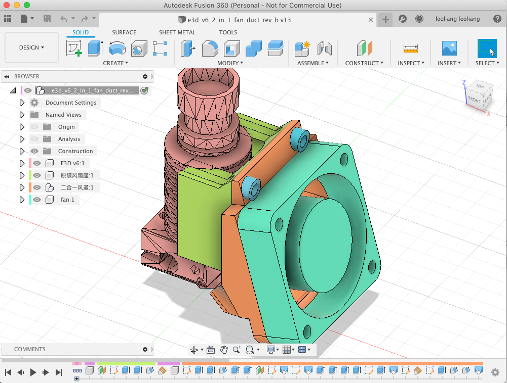
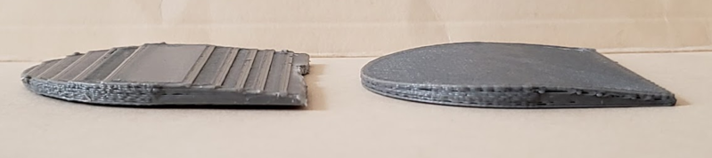
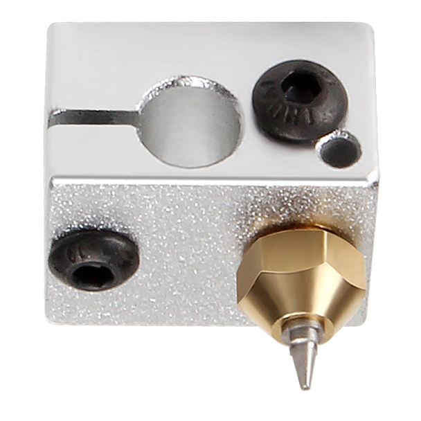
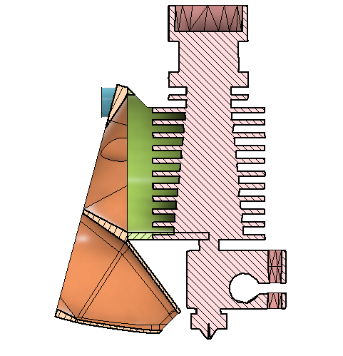
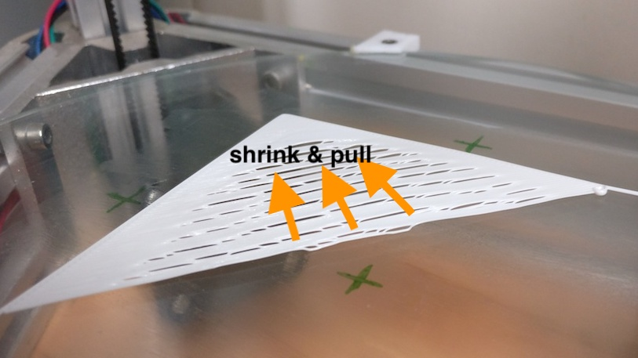
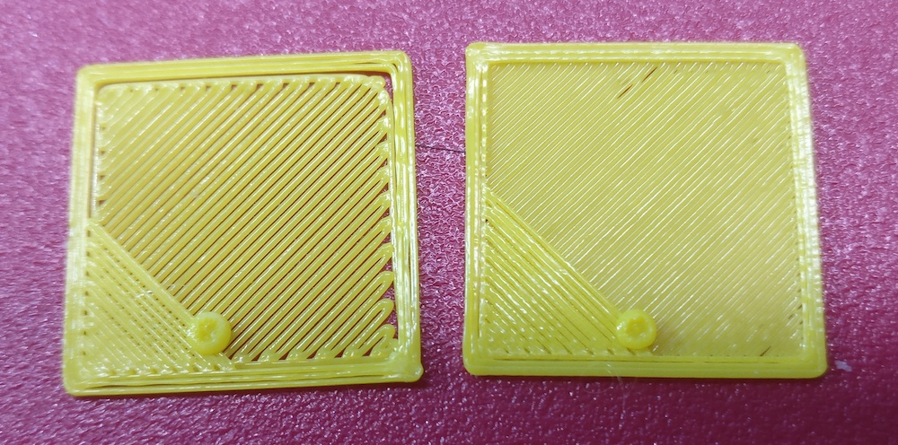
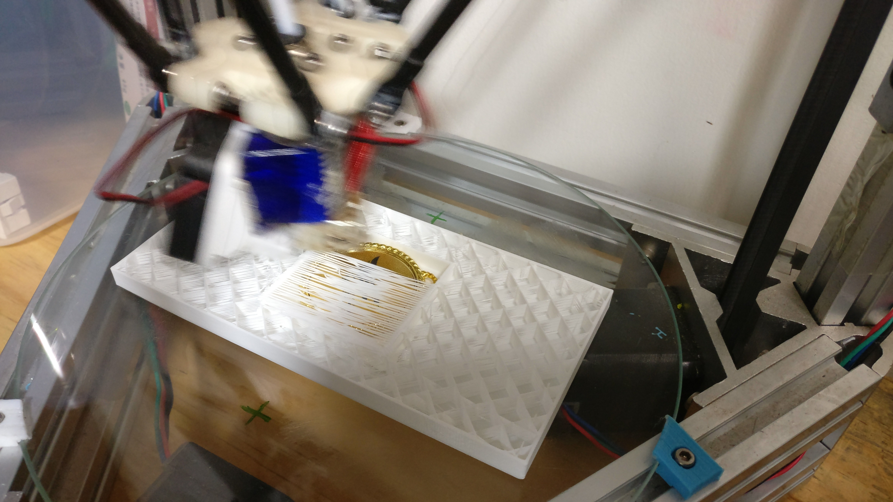

3D 打印机玩了两年多，最近两个月折腾了一番，又有一些新的心得。

<!-- more -->

## 软件

### 建模软件：Fusion 360

不知道是不是因为很久以前玩过的类似软件不好用，一直对用鼠标绘图的建模软件敬而远之，因此用像写程序一样的建模语言来做模型。之前就写过我使用过的 ，其中主要用的是 Relativity SCAD，玩了一年半，算比较熟手了，大部分模型都是用它来做的。

但是建模语言也有一些缺点：

- 不直观。需要先在纸上画草图，当时做的时候还好，脑子里能够将代码和图对得上，可是过了几个月回头想修改的时候，就要花一些时间来理解代码了。
- 所有东西都要由球体、立方体、圆柱体三种基础集合体组合而成，曲面特别难做，只能勉强用hull解决一部分。想把过渡面弄平滑基本上搞不掂，增加个支撑肋条都麻烦得要命。
- 总有各种小问题需要解决

有一次在 YouTube 上看了一个视频介绍用 Autodesk Fusion 360 来做打印模型的受力分析，就安装了 Fusion 360 来试了一下，对基础操作了解之后，发现使用并不复杂，再看了一些介绍的视频，对这种基于绘图的建模软件的观感完全改变了：

- 它同样可以跟建模语言一样做参数化设计，随时可以修改参数去改变模型尺寸。
- 通过创建多个参考面画平面图来构建出立体模型，十分直观。
- 通过底下的修改历史进度条，随时可以独立修改之前的某个操作，或者在之前某个步骤的位置插入额外的操作。并不是想我以前以为那样很难修改以前画好的东西。
- 过渡面、斜切、肋条这些细节修改做起来轻而易举。

在 YouTube 上有不少很好的教学视频，边看边试，做了几个模型后基本上也能上手了，一下子就变成了我现在建模用的主力工具。Fusion 360 对个人使用提供免费无限期许可，对于功能这么强大的软件真是很不错。

### 切片软件：Slic3r - PrusaSlicer - Slic3r++

自从做好3D打印机以来一直用的是开源的 [Slic3r](https://slic3r.org/)，它一直也没有怎么出过升级版本。直到最近两个月，我才知道 Slic3r 有一个fork叫做 [PrusaSlicer](https://www.prusa3d.com/prusaslicer/)，在 Slic3r 基础上增加了更多的功能。在 Reddit 上有人评价：完全找不到理由从 PrusaSlicer 转回 Slic3r。既然如此，就下载下来一试，果然：Slic3r的配置选项本来已经多得眼花缭乱了，PrusaSlicer又增加了一堆。然后过了两个星期，再发现了另外一个fork：[Slic3r++](https://github.com/supermerill/slic3r)，这虽然好像只是一个个人的项目，但它在PrusaSlicer的基础上增加了几个很好的改进：

- Ironing：在打印完上表面后，用打印头在上面重新再“熨”一遍，将纹理抹平。打印出来的表面平滑了很多，效果相当理想。
- Denser infill：有了这个功能，内部填充密度可以低至4%，上表面只打2实心层，也不怎么影响上表面的封口质量。
- 打印 overhang 和 bridge 更容易一些，优化了打印路径。不过，我也观察到打印桥的时候曾经出现不合理的路径，还有需要改进的地方。

它还有其他一些小改进，但就上面几个就足以让我切换到 Slic3r++ 上来了。

## 打印机硬件

### 尖头喷嘴与非平面打印（non-planar）

在YouTube看到一个介绍[非平面打印](https://youtu.be/gmePlcU0TRw)的视频，想尝试一下，就买了一个尖头的打印喷嘴。

先说什么是非平面打印。FDM（熔融沉积）打印是在Z轴上一层一层的把打印材料堆积起来的，打完一层后打印头上升一层高度，再打一层。典型一层的高度是0.3mm。对于打印比较平缓的斜面时，就会有明显等高线阶梯，表面不精细。但实际上打印头是可以在Z轴上运动的，层并不一定需要为水平面。Non-plannar slicing 是通过一定的算法，让打印头在打印模型上表面时，打印层为一个曲面，减少等高线阶梯。这个思路在几年前已经在网上有描述，去年一位汉堡大学的学生将这作为他的毕业论文课题，并且基于开源Slic3r开发了一个基本可用的[实现](https://github.com/Zip-o-mat/Slic3r/tree/nonplanar).

当打印层不在一个平面上时，打印到凹陷的地方时，打印头上面的部件就有可能碰撞到已打印的凸起位置。因此打印头突出得越多，能够打印的曲面倾斜度越大。

淘宝上看到有卖这种不锈钢尖头的打印喷嘴。这应该是转接了绘画喷笔的喷头，在国外网站也是早年有讨论，现在国内都量产了。比起E3D喷嘴，这种喷嘴的净空高度增加了好几毫米。

可是，换上这个喷嘴后，立马就堵丝了。检查发现应该是因为温度的问题：尖嘴处的热容量小，再加上风扇吹着，温度下降得比较快，打印材料冷却了就堵住了。升高打印温度解决了堵头问题，但多番调试始终打印效果都不理想，出现各种问题，后来就换回了普通喷嘴。

现在复盘一下，主要应该是这些问题：

- 原来用的是带铁氟龙内衬的喉管，上面还是有个接缝。不知道是因为用的时间长了接缝变大，还是什么原因，材料冷却后会卡在接缝处。后来我更换了直通的喉管，进料铁氟龙管一直伸到加热块前面，中间没有任何接缝。
- 调平探头的海绵套不适配尖头外形，不能在上面卡住。我做的临时固定措施不牢固，造成自动调平的误差大，所以打印首层不能贴合打印床。
- 需要调整打印工件降温风扇的风量的吹风位置，让出料温度合适，既要保持熔融状态顺畅挤出，又要能够在挤出之后迅速冷却。怎样才是最佳的还有待实践。

结果就是根本没有机会尝试到非平面打印。不过暂时也先不折腾了，更换喷嘴太麻烦。毕竟现在唯一能支持这个功能的slicer还是试验性的，日常应用还是有不少限制，等什么时候软件完善了再来试试。

### 风扇

在试验尖头喷嘴的时候感觉风扇需要调整一下，于是将二合一散热风道的设计又重做了几个版本。

尝试了不同的风量比例、出风口大小、角度、吹风位置，总结了一些经验：

- 轴流风扇的风压小，风道出风口不能收得太小，越直越好，否则出风量很小，空气甚至会在风扇处倒灌。如果换成用径流风扇（涡轮风扇）做工件散热应该会好些，但这样就得装两个风扇了，增加打印头的体积和重量。
- 向工件吹风的目的是要将喷嘴挤出的材料在刚挤出的瞬间就迅速冷却，一方面是打印悬空结构时让挤出材料不下垂，另一方面（可能）有助于减少后续冷却带来的收缩。因此，出风方向应该正对着喷嘴尖端，让挤出处的风量最大，散热效果最好。而对于已经打印出来的工件，
- 观察到打印桥的时候风力似乎会将拉丝往下压，造成桥的下垂，因此可能出风角度尽量接近水平一些有好处（不能肯定）。

## 调试

更换元件，调试过程中间出过好几个问题，一度打印效果非常差。以下是遇到的几个问题，解决后基本上打印质量比较理想了。

### 首层裂开上翘

这个问题在更换风扇风道后出现，还去 StackExchange 上提过[问题](https://3dprinting.stackexchange.com/q/11800/162)。打印首层过程中，中间裂开翘起，但是边缘贴合打印床又没有问题。尝试过清洁玻璃板、更换胶水、delta参数校准、Z校准都不起作用，最后仔细观察打印过程，发现打印丝刚挤出来的时候是贴合玻璃板的，然后它就被扯起来了，是因为前面已打印的相邻材料在冷却收缩。首层打印时关闭风扇，就不再出现这个问题。

但是，我以前一直都是打印全程风扇全开的，也没有出现过这个问题。其实是因为吹风位置改变引起的，没有及时冷却刚挤出来的材料，而是变成冷却已经打印成型的模型，造成模型的收缩。后来调整吹风位置，直接吹向喷嘴尖端就好了（见上面风扇一节）。

### 挤出不足

这个问题是在尝试0.2mm层高时发现的，起初认为是slicer软件问题，在github上提了issue，作者说我的0.3mm层高打印（右侧）其实也是挤出不足的。

自从打印机装好以来，一直没有校准过挤出量，感觉上差不多。固件里的挤出参数是根据步进电机和齿轮参数算出来的，想着应该没错吧？

这次就认真的测量了一下：用笔在打印丝上做记号，发指令让挤出机慢速走个50mm左右，测量实际上打印丝的移动距离。惊讶的发现居然欠了15%左右，怪不得挤出不足。按实测比例修改参数，反复测量两次，大概就校准了。这时0.3mm层高的打印饱满了很多，打印0.8mm薄壁测试，用游标卡尺测量，厚度也误差很少了。

### Z offset

挤出电机的系数校准后，0.2mm层高的首层依然空隙很大，没有什么变化。后来发现是打印头的Z位置不准，Z=0 时与打印平台有零点几毫米的空隙，因此首层实际高度高了许多，自然挤出量就不够了。重新做 delta calibration 之后解决问题。

### 最大挤出速度

打印速度可以去到多高？Delta结构的打印机，打印头移动速度在XYZ坐便轴上都可以相当快，但是这只是移动的速度，实际打印时限制打印速度的还有挤出的速度，如果材料的挤出跟不上，打印头移动得过快只会造成欠料，质量降低。而挤出速度也不是仅仅由挤出机决定的，挤出机很够力，但加热块的热量不足以融化大量材料，也挤不出来。

测试最大挤出速度，同样需要在打印丝上做标记。按照平常使用的打印头加热温度，每次挤出50mm，看看挤出过程中是否有停顿（打滑），寻找最快的速度。测试结果是180度时，最大挤出速度为 4mm/s（F240）。

材料的长度可以换算为体积，对于1.75mm的材料，每毫米体积约为 2.4立方毫米。对于测试到的最大挤出速度，也就是最大挤出体积为 9.6mm^3/s。

实际打印时，因为挤出后空间限制，造成backpressure，特别是打印填充时，挤出速度远小于理想速度。根据[这里](http://www.soliforum.com/topic/15529/finding-maximum-print-speeds/)的测试，不同层高的实际挤出速度相对于理想速度的比例为： 0.1mm 38%，0.2mm 61%，0.3mm 92%。这个具体数值肯定会受很多因素的影响，我也懒得测试了，留个安全系数应该差不多。

在PrusaSlicer里面，可在 Filament Settings -> Advanced -> Print speed override -> Max volumetric speed 设置挤出速度限制，以限制最高打印速度不超出挤出可承受速度范围。根据上面计算，0.3mm层高时不应大于 8.8mm^3/s ，0.2mm层高时不大于 5.8。考虑增加85%的安全系数，设置成 7.5 和 4.9 比较合适。目前还不知道冷却风扇对实际挤出时的最大速度会带来多大影响。

## Marlin Firmware

最近也升级了打印机的固件。[Marlin Firmware](https://marlinfw.org/) 在长长的开发周期之后，终于正式发布了2.0版本。2.0版本主要是32bit，增加了对很多控制板的支持，但对于我用的低端 Arduino，其实没有什么区别。装2.0试了一下，感觉有点不是很稳定，不记得具体啥问题了，反正换回了1.1。惊喜的发现，其实2.0里面见到的新增功能，在1.1分支的最新版本里面都已经有了。

### 加载/卸载打印材料

升级固件后，最大的好处是装载和卸下打印丝方便多了。因为是远程送料，以前每次都要先预热打印头，等到温度够了后，手工把打印丝穿过挤出机，一直插到打印头，有融化的材料挤出来为止。要卸下打印丝也一样，预热温度够了手工抽出来。现在菜单里面就有 load/unload 选项，固件里配置好参数，菜单一选，就自动预热，自动进/退料到位。

### 暂停

另外一个功能是可以在打印过程中暂停，暂停可以有两种用途：更换打印材料（换颜色）；往打印工件内部空腔放入东西（例如一块磁铁），恢复打印后就可以将上面封口，将物品封闭在打印件内部。

这需要在slicer中配合，往预定的层上插入M25（暂停打印）指令，打印到那个层，打印就会暂停，并且打印头移到一个安全位置。这时可以卸下原来的打印丝，换上另外一盘不同颜色的，然后菜单选择继续打印，它就会回到原来位置继续。

### Advanced linear

按[介绍](https://youtu.be/n3yK0lJ8TWM)，这个[功能](https://marlinfw.org/docs/features/lin_advance.html)能够改善打印速度变化时出料不均匀的问题，不需要各种高级的回抽的设定。可是当时我测试的效果并不好，后来把它关闭了。现在看来，是因为测试前并没有先校准好挤出量，当时是出于挤出不足的状态的。以后有空可以再试一次，看看效果如何。

## YouTube

前面提到，关于3D打印的很多新了解我都是从 YouTube 上面看到的，上面的关于3D打印、机械、设计方面的视频让人大开眼界。其中，对于3D打印尤其推荐一个大神 [CNC Kitchen](https://www.youtube.com/channel/UCiczXOhGpvoQGhOL16EZiTg)，他制作了很多视频，每集关注一个主题，测试不同的打印参数、材料、后处理方式对打印效果的影响。

