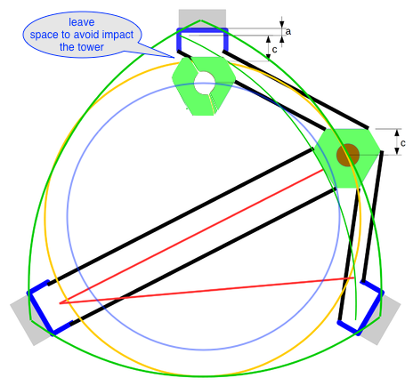
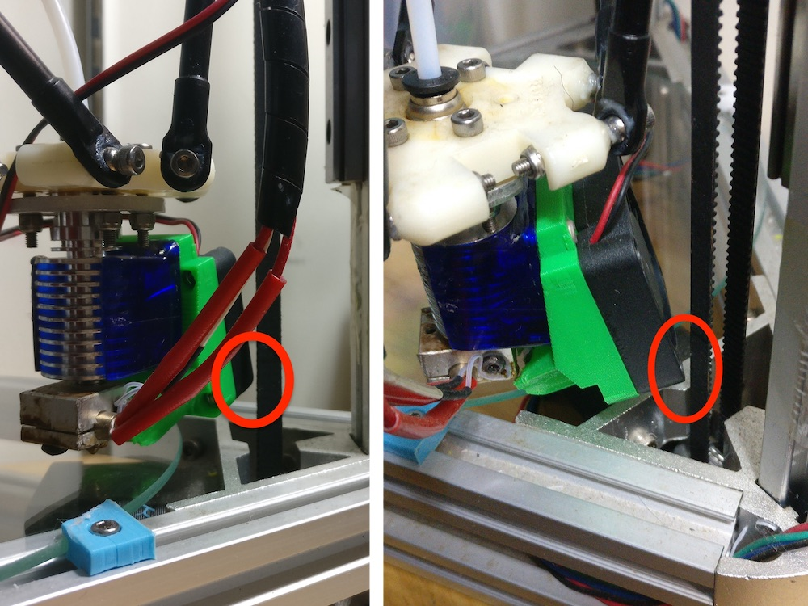
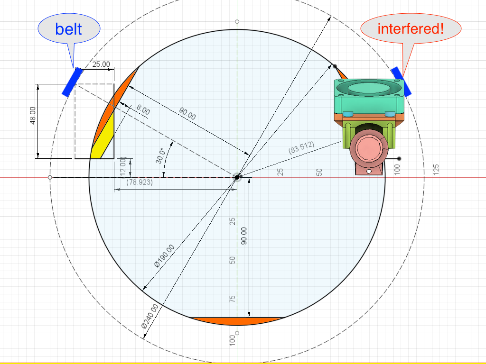
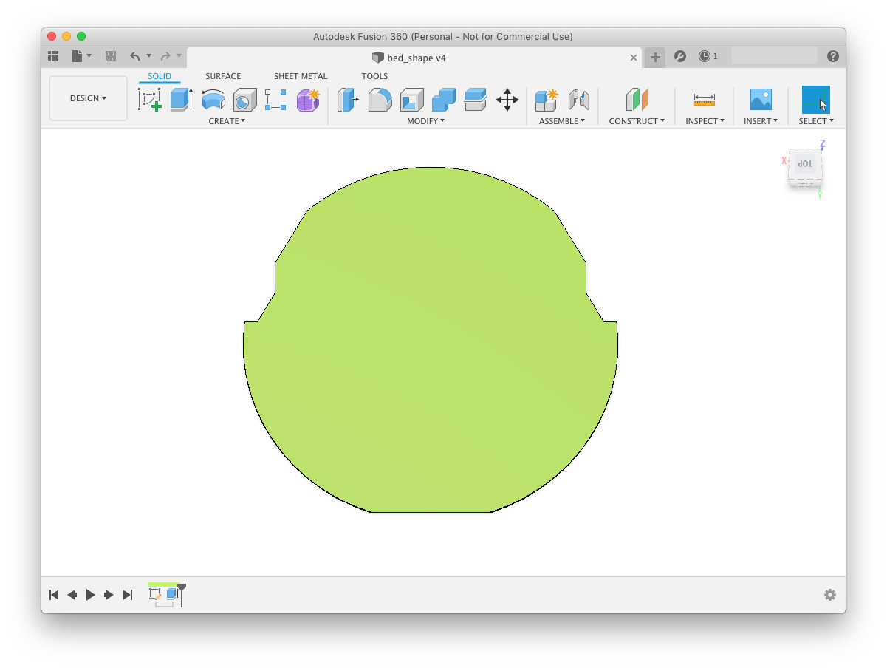
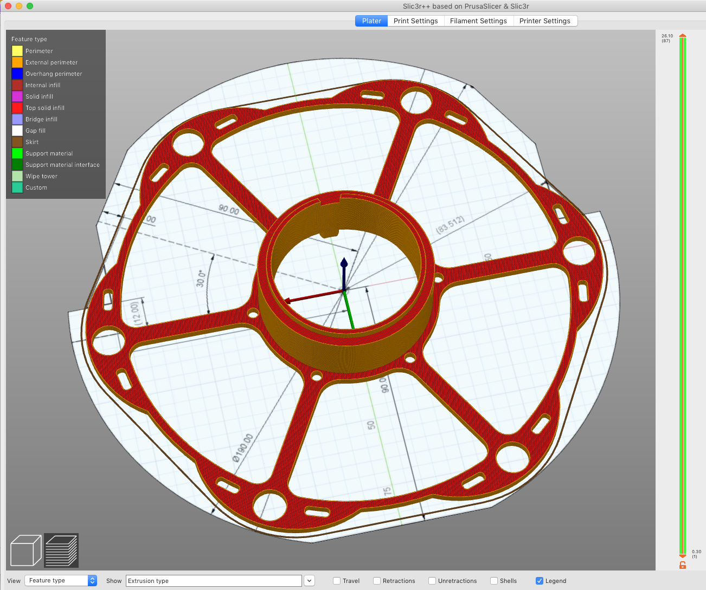

In firmware, the printable area of delta printer is set to be a circular area. But you can't set the printing area diameter as large as the printer head reachable area (yellow circle), because the effector and fan need extra space. You have to set a smaller diameter (blue circle) to avoid impacting the belt. (Image originates from [reprap](https://reprap.org/wiki/Delta_geometry))

How can I make use of most of the printer head reachable area as printable area? Slicer software e.g. Slic3r/PrusaSlicer has feature to set bed shape from a STL file. It allows you to set bed shape in any irregular shape, and it will alert you if the part is placed outside the printable area. In this way you can set a large printing area diameter in printer firmware, and exclude the areas where interfering will happen inside slicer bed shape setting.

I used Fusion 360 to model the real printable area of my Kossel Mini printer. The print bed glass is 200mm diameter, so I first drew a 190mm diameter circle as the basic printable area. It's also set into the firmware.

I connected the printing host software on PC to my printer and sent G-code to find out the edge positions of the printable area.

The orange areas are too close to the tower, where the effector will impact the belt. Yellow areas need to be excluded as well. In those areas, the fan interferes with the belt.

After the sketch is ready, extrude the printable areas 1mm (the height doesn't matter) to make a body. Export it into .STL file then load it into bed shape setting of the Slic3r software.

I also captured the sketch into a .png file and loaded it as texture of printer bed into Slic3r. Now in Slic3r viewer it shows the printer bed shape with grid and dimensions. It's handy, isn't it?

