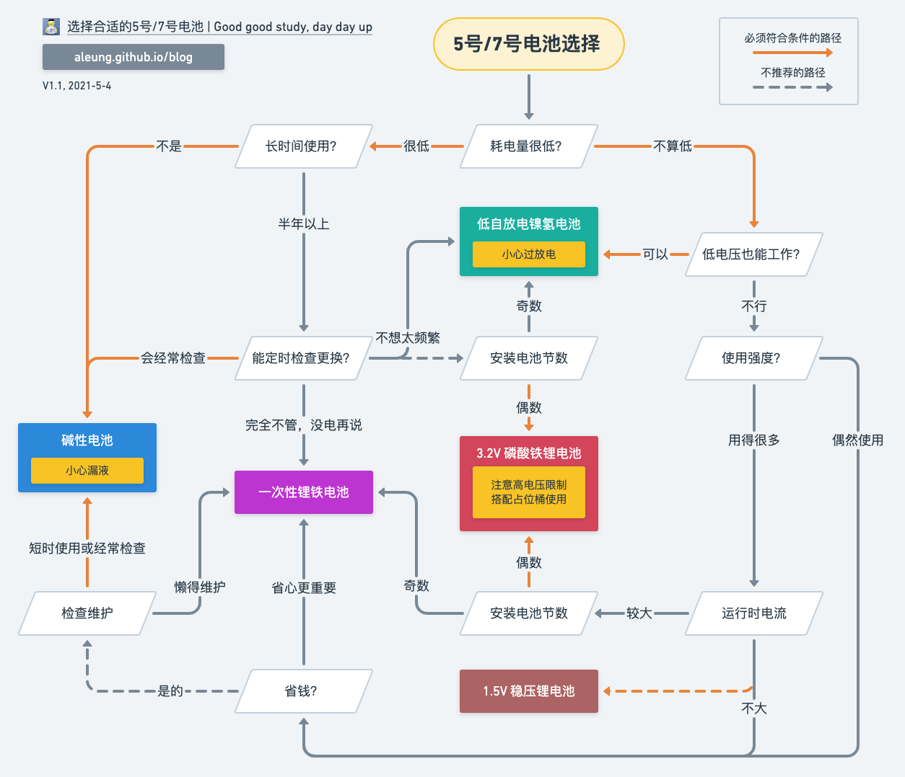

虽然现在内置锂电的电子产品越来越多，可是5号、7号电池的使用场景依然不少。现在这种尺寸的电池种类有很多种，包括一次性电池和可充电电池，各自有不同的特性，适合的场景各有不同。

### 按图索骥选择电池

各种电池的特性各异（在下文中有介绍），选择并不容易。根据满足应用场景，尽量低成本的原则，做出下面的判断流程图。其中橙色的线是必须要满足条件才能走的路径，黑色线可以根据偏好而忽略条件判断来选择。可能会有考虑不完善之处，欢迎留言讨论。

<!-- more -->

_Diagram source: https://whimsical.com/ChUoqFHMLZzKPzHiP9F5hq_

### 电池分类

同样外形尺寸的电池，不同类型会有不同的编号。要选择电池类型，首先要知道它们的编号。这个[wikipedia页面](https://www.wikiwand.com/en/List_of_battery_sizes)列出了各种标准的电池型号和尺寸。

- 5号（AA）电池，IEC编号为R6，对应锂电池的外形规格是14500。
- 7号（AAA）电池，IEC编号为R03，对应锂电池的外形规格是10440。

对于5号/7号尺寸的电池，现在会用到的有以下种类（不推荐使用的就不列出了）：

一次性电池

- 碱性电池：容量在2000mWh左右，缺点是时间长会漏液

  - 网上推荐品牌：小米/紫米彩虹，京东京造，宜家

- 锂铁电池：容量大，4500mWh左右；放电电流大，放电平台高且平稳，自放电极低（2%/年）；不漏液，重量轻。价钱稍贵。

  - 目前主要可以买到的品牌：耐时，小米超级电池

可充电电池：

- 镍氢电池（NiMH）：典型容量2400mWh/960mWh，放电电流大；自放电稍大，不适合过长时间使用，但目前以Eneloop为最出色代表的低自放电电池解决了此问题，实际应用中只建议使用低自放电的；放电平台低（1.2V左右），有些电子产品会因电压太低不能用。

  - 网上推荐品牌：日本富士通FDK生产白色Eneloop（国内产的是松下evolta技术，性价比低不推荐），紫米1800（松下代工，相当于国内产Eneloop），宜家Ladda（富士通FDK生产，相当于日本产Eneloop pro）

- 锂聚合物（Li-ion）电池，内置稳压电路：容量2900mWh，恒压1.5V，但会造成用电器无法识别低电量（部分产品会在低电量时降压以供检测）；因为降压电路的存在，放电电流不够大，自放电大；网上有人反映寿命不长。目前价格比较贵。

- 镍锌电池：放电电流大，容量2500mWh，放电平台很平稳且极高（1.6～1.7V）；循环次数少寿命短，因放电截止电压太高，在大部分用电器上会过放电而损坏。不推荐使用。

- 磷酸铁锂（LiFePO4）电池：放电电流大；容量低，5号尺寸典型650mAh, 2000mWh（因为要和占位桶搭配使用，相当于1000mWh，不足镍氢40%），7号尺寸只有220mAh，700mAh；放电平台很平稳3.2V，因为电压太高，需要搭配占位桶（假电池）才能用；重量轻。

  - 目前主要可以买到的品牌：倍量（其他很多品牌声称超过700mAh的都是虚标的）

另外，下面列出常见的可充锂电池。但是可充锂电池一般都是18650尺寸的，电压也高很多，并不能替代5号/7号电池。

- IMR 锰酸锂（LiMn）：动力电池，电流大，容量相对小一点
- Li-ion 液态锂离子电池：标称电压3.7V，充电截止电压4.2V；也有高压电池标称3.8V，截止4.35V
- 磷酸铁锂（LiFePO4）：标称电压3.2V，充电截止电压3.6V；耐过放电能力相对比其他类型好一点。

由于锂电池的充电截止电压有几种不同，充电时一定要注意在充电器上选择正确的类型。一般的智能充电器当识别到锂电池时，都是按照缺省4.2V截止，充磷酸铁锂一定要改成3.6V。

## 选择的原则

再看回开头的选择流程图，其实背后基本上是这几个原则：

- 如果对价格不敏感，一概选择一次性锂铁电池是最省心的。无论是大电流高耗电，还是低耗电长时间使用都适用。电量也比碱性电池大不少。
- 对于低耗电的应用场合，不错的碱性电池大概1元一粒就能买到，其实是很划算的。问题就是碱性电池时间长了就漏液，各种品牌无分贵贱都无一例外。等到发现设备电量低不能工作时已经漏液了，需要隔一段时间就用万用表测量一下电压才保险。
- 充电电池，优先选择低自放电的镍氢电池，在容量、性能、价格方面都比较均衡。唯一的问题是电压太低，有些设备用一下就显示没电了，实际上电池的电量还没有用完。在有电动马达的设备中，电压低了也会显得没力。自放电低，也可以用在低耗电长时间运行的场合，例如遥控器、电子钟、电子温度计之类，不过还是得定期更换充电，不能用到没电为止，以免过放电损坏电池。
- 磷酸铁锂电池用起来比较麻烦，如果有其他选择尽量不要用它。跟其他类型电池比起来电量偏小，并不耐用。3.2V的电压，如果当成普通电池使用很容易弄坏设备；充电器也需要设置到专门的截止电压，用错会有危险。家里其他人通常不会搞，要说清楚才行。但是，在需要大电流和稳定电压的场景，充电电池中唯有磷酸铁锂才能用。
- 锂聚合物降压到1.5V的电池优势不多，目前看来没什么性价比。