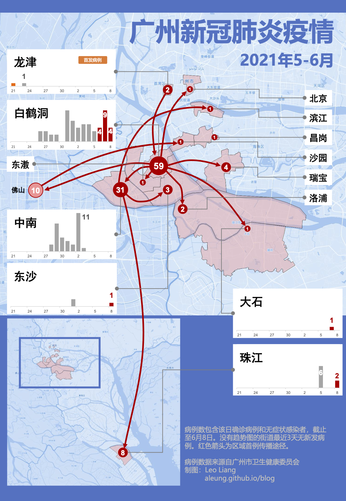
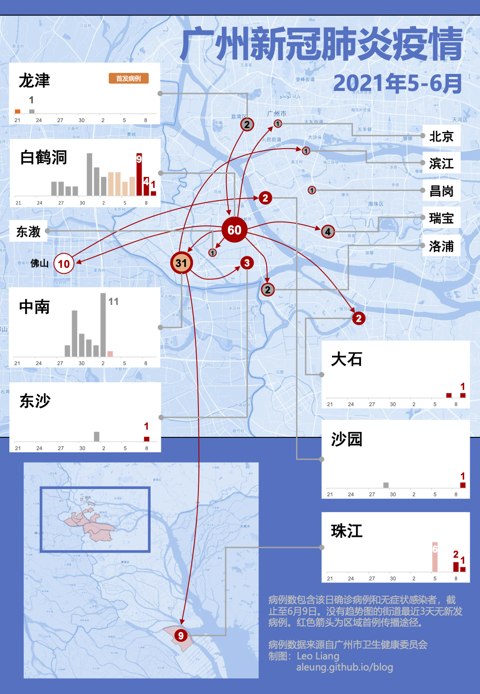

最近在看一本书《[用数据讲故事](https://book.douban.com/subject/27108685/)》，介绍用故事思维做数据可视化。看过后想找个东西来练习一下，正好最近广州一波COVID-19瘟疫爆发，就试着做一个疫情的信息图。

这张图要传达些什么信息呢？我的目标是向关心疫情的普通民众解释：

1. 哪里出现了病例？
2. 这些地方的疫情有多严重？
3. 随着时间过去，情况发生了什么变化？
4. 从一开始一个阿婆得病，到后来多处爆发，疫情是怎样变得严峻起来的？

另外，信息图要在社交媒体发布，我设想它应该能在手机上比较轻松的阅读。

_6月8日疫情信息图_

<!-- more -->

**哪里出现了病例？**

随着疫情升温，社交媒体上传播的信息越来越纷杂，有些是不实传闻，有些是将密切接触者/此密切接触者也当作出现病例。新闻报道和政府公告中列出的地名并不直观，例如一直说荔湾区出现疫情，我过了好多天才知道其实严重的是芳村而不是老荔湾。有些稍偏僻的地方名称不是所有人都熟知。再加上政府的防疫措施例如局部地区封闭、全民核酸检测等在全市各地都有进行，让很多人没有完全弄清楚出现病例的是哪些地方。

对于在哪里这个信息，用地图来表示应该是最直观的。

**这些地方的疫情有多严重？**

回答了哪里出现了病例这个问题后，接下来大家很自然的就会想知道有多少个病例，一个地方只有一两个病例和几十个病例的严重性显然是不一样的。另外，网上流传的哪儿有密切接触者的信息让人心惶惶，但密切接触者只是危险因素，已确诊病例（包括无症状感染者）才是更严谨的反映严重性的指标。

每个地方的数据就是一个数字，最简单和直观的展示方式就是把这个数字标出来。另外，为了直观的对比不同地区的情况，在地图上使用气泡图来反映这个数据。考虑视觉上不要太过繁杂，只使用了4种气泡大小。

**随着时间过去，情况发生了什么变化？**

上面的累计病例数字并不能反映变化的趋势：情况是已经好转，还是还在恶化中？已经层层加码的防疫措施是否起到了作用？

将单日的确诊数字列出来，就比较好反映趋势了。本来随时间变化的数据最典型是用折线图来表示，但我发现每日确诊数字并没有非常强的连贯性，跳跃比较厉害，可能用柱状图的效果更好一些。为了控制版面，突出重点，省略了病例很少并且最近几天没有新发病例的地区。

**从一开始一个阿婆得病，到后来多处爆发，疫情是怎样变得严峻起来的？**

这是需要更进一步发掘的信息。第一个病例出现时，大家还有点不以为然，到后来多处爆发，防疫措施不断升级，包括带走隔离密切接触者、禁止堂食、突然封闭小区做大规模核酸检测、交通封锁禁止离开等等，让市民都懵了，不知道疫情是怎样突然变得严峻起来的，封区和全民检测这些措施是必要的吗？针对这个问题，可以从很多个角度来分析。在刚开始只有十来个案例的时候，已经有传媒做了流行病学调查的信息图，将每个病例之间传播链展示出来。我不想继续在这个角度去叙述，一方面是公开资料不足够，另外我觉得大众对进一步的传播链分析并不会很感兴趣。但是，大家还是会关心为什么在一个新的地方出现病例：首先这会引起紧张，意味着疫情扩散；另外是新闻效应——原来没有病例现在出现了，肯定是有特别原因的，而已经出现病例的地方传染给家庭成员或者社区中接触的其他人，那就不太奇怪（事实上也是这样）。故此，我选择了这个角度来描述：瘟疫是怎么进入一个地区的，也就是首例的传播途径。

这个信息也是与地理位置相关的，故此还是在地图上展现，我用了连接图（connection map）来描述这个信息。

**图幅大小与细节**

开始做的时候对这个没有什么概念，先试着把地图底图做出来，再添加部分元素来看看效果。比我想象中好一些，基本跟做PowerPoint slides差不多的图像元素尺寸，在手机上看问题都不大。局部细节可能需要放大一级来看，但不会出现反复拖动看不到全貌的问题。最初担心可以显示的宽度不足，需要用纵向长条的图幅，而因为地图的固有比例，长图会很难排版。最终没有这个担忧，用了A4的比例，一屏就能看全。

为了能在手机不大的屏幕上容易阅读，尽量缩减了图的复杂性，限制色彩使用的数量。

**统计单元**

这张图的几个信息都涉及到“哪里”，到底应该用什么作为统计的单元呢？最初我的想法是与政府划定的风险区一致，但查看了公告后，发现除了芳村的中风险区是以街道为单位外，其余的都是细化到一栋楼、一个小区。这么小的地理单元在统计上意义不大。

后来，我决定以[街道](https://zh.wikipedia.org/wiki/%E8%A1%97%E9%81%93%E5%8A%9E%E4%BA%8B%E5%A4%84)作为统计单元，主要原因是街道是乡级行政区，在城市管理工作中的角色很重，在当前广州的疫情防控工作中，很多措施都是在街道这个层面上进行的，另外病例所属街道的信息在政府公告上可以查到，有可靠信息源。在核心城区中的街道面积用作病例统计比较适合，不过外围城区的街道面积就要大很多，从图中可以看到可以有十倍以上差别。是否有更好的统计单元？这可能是可以改进的地方。

**反馈及修改**

在6月8日的图上，有病例的街道在地图上用了浅红色覆盖，用意是容易看出街道的地理范围。但正如上面所说，有些街道面积太大，例如番禺的洛浦、大石，只有一两个病例，就把二十多平方公里的地域标红了，容易让读者误解全部都是疫区。在6月9日的图中，做了另外一个尝试：去掉大面积的颜色覆盖，仅保留气泡。对于只有少量病例的街道，气泡并不是标注在地理中心，而是标注在病例出现的大致位置。这样做解决了疫区误解的问题，但比起之前少了街道地理区域的信息，视觉效果上好像也差了一些。

第一天的图容易误解可能还有一个原因是配色——浅红色让人理解为危险区域。如果改成中性的颜色可能也会好些。在《用数据讲故事》作者的blog中最近一篇文章 [colors and emotions in data visualization](https://www.storytellingwithdata.com/blog/2021/6/8/colors-and-emotions-in-data-visualization)，正好就提到了 map of COVID-19 cases 的例子：一个图是用了红色"bloody-red"，另一个图“using more decent colors to avoid an emotion of fear”，选择了蓝-绿色系，两者传递的情感就很不一样。

_6月9日疫情信息图_

第二天的图还做了少量改进：气泡图用不同颜色添加了额外一个维度的信息——是否在最近3天/7天出现新的病例。这样改动后，地图上的信息量增加了，能直观的区分出一个地区的疫情是否已经受控。不过采用的配色并不理想，辨析度不够，还需要改进。

**不足**

一个粗糙的练习作品，做出来的图在美感方面相当欠缺。配色、字体、版面设计，都是将就着做出来。一动手就暴露出自己在这方面没有知识储备，没有经验，胡乱尝试怎么都不顺眼。

地图上的线条比较多，包括表示传播途径的红色箭头和指示气泡对于街道名称的灰色线，显得有些杂乱，不知道有什么改进的方法。

最后，也是最核心的，在一张图里展示这几样信息，到底是太多了还是不够？这个故事讲好了吗？受众有没有明确？我所讲的是他们关心的吗？

这次疫情的数据还可以从很多不同的角度来分析，例如flyisland就做了一个图，分析传播链条中各个节点的R值，从中可以观察到有哪些超级传播者带来影响。可是他的图好像只发布在微信中，没有web上可链接的资源。

