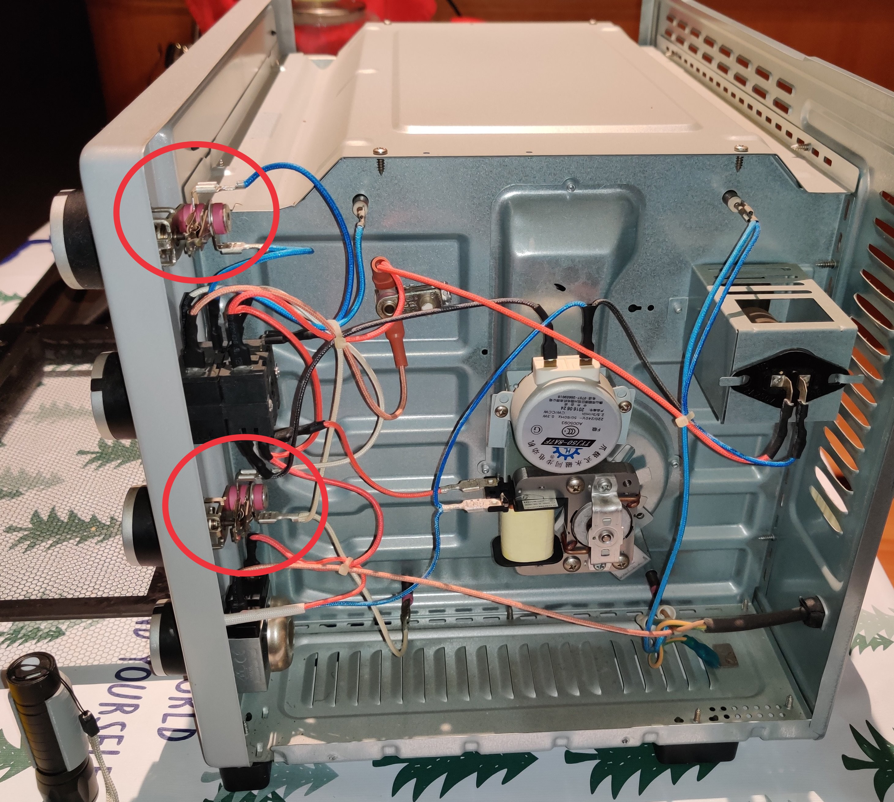

拆开烤箱看过才知道机械温控器的双金属片就是安装在温控旋钮后面，因此它测量的是温控旋钮处的温度，而不是烤箱内腔里的温度。

找 Bard 问一下，回答是这样的：

> 由于机械温控器的温度传感器距离烤箱内部较远，因此测量结果会受到外界环境的影响，例如烤箱门的密封程度、烤箱内腔材质等。因此，机械温控器的温控精度通常较低，在烘焙等对温度要求较高的场合，不建议使用机械温控器的烤箱。
>
> 电子温控器的温度传感器通常安装在烤箱内部，因此测量结果更准确。电子温控器还可以通过微电路进行温度控制，可以实现更精准的恒温效果。因此，在烘焙等对温度要求较高的场合，建议使用电子温控器的烤箱。

虽然知道机械的不会太准，没想到也太离谱了，这样受环境的影响大，腔内温度变化的反馈也很慢。看来还是得电子温控的才靠谱，要不就必须要在烤箱内放温度计，人工 PID 😀
